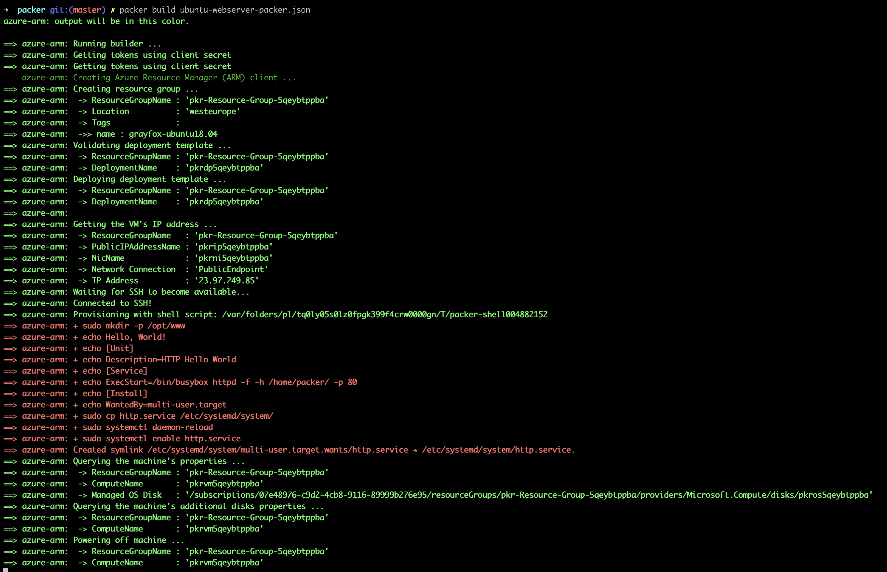

# Azure Infrastructure Operations Project: Deploying a scalable IaaS web server in Azure

## Introduction
For this project, you will write a Packer template and a Terraform template to deploy a customizable, scalable web server in Azure.

## Getting Started
1. Clone this repository

2. Create your infrastructure as code

3. Update this README to reflect how someone would use your code.

## Dependencies
1. Create an [Azure Account](https://portal.azure.com)
2. Install the [Azure command line interface](https://docs.microsoft.com/en-us/cli/azure/install-azure-cli?view=azure-cli-latest)
3. Install [Packer](https://www.packer.io/downloads)
4. Install [Terraform](https://www.terraform.io/downloads.html)

## Instructions
The following steps demonstrate how to deploy the packer image and spin up the Azure infrastructure via Terraform.

### Deploy the Packer Image
Get **YOUR_CLIENT_ID**, **YOUR_CLIENT_SECRET** and **YOUR_SUBSCRIPTION_ID** from the Azure Portal.

#### Export credentials
```bash
export CLIENT_ID=YOUR_CLIENT_ID && export CLIENT_SECRET=YOUR_CLIENT_SECRET && export SUBSCRIPTION_ID=YOUR_SUBSCRIPTION_ID
```

#### Build packer image
Make sure you changed to the **packer** directory. 

You can rename the image in the packer json. The default is : grayfox-ubuntu18.04

```bash
packer build ubuntu-webserver-packer.json
```




#### Delete packer image
Delete the packer image if it's not needed anymore.

```bash
az image delete -g packer-rg -n grayfox-ubuntu18.04
```


### Spin up the infrastructure via Terraform
Make sure you changed to the **terraform** directory.

#### Adapt the preconfigured variables in *variables.tf*
```tf
variable "instance_count" {
  description = "The number of instances to create."
  default = 1
}
```

#### Init Terraform
```bash
terraform init
```


#### Plan infrastructure
```bash
terraform plan -out infra.plan
```


#### Create infrastructure
The Terraform script will also assign and print out a dns name automatically.

```bash
terraform apply "infra.plan"
```


#### Show created infrastructure
```bash
terraform show
```

#### Output

After the deployment, remember to destroy the resources.

``` bash
terraform destroy
```
